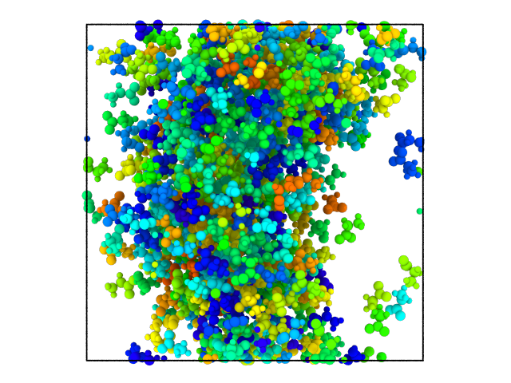
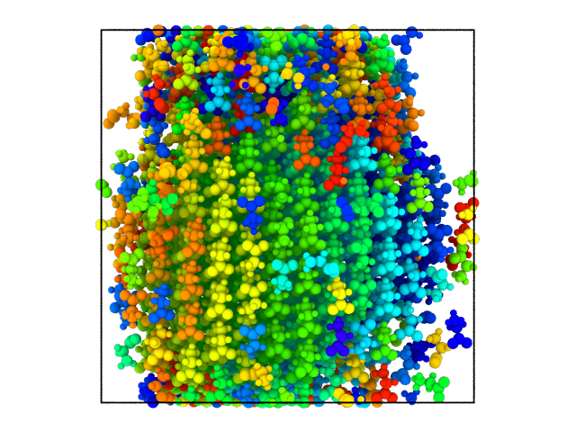

# Glycine-Nucleation-MD-Simulation
Master Thesis Project for Computational Science at the University of Amsterdam. We study the nucleation event of the glycine amino acid through Molecular Dynamics Simulation. We find that Glycine follows a two step nucleation process: During the first step the molecules form an amorphous liquid-like cluster. In the second step this cluster crystallizes from within until the entire system is in a solide crystal state. 

  

    
    
Amorphous cluster

  

  

    
    
Crystal

  

